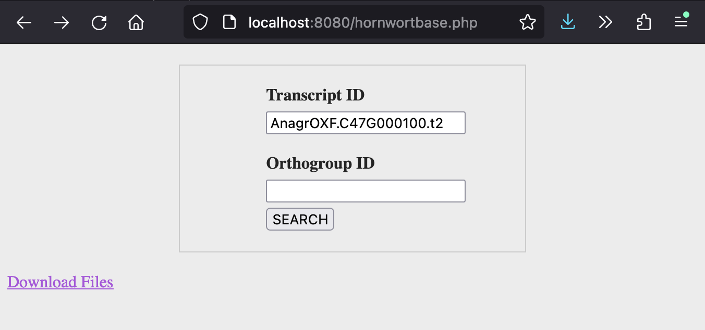

Login with an SSH tunnel to port 8080:
```
ssh -L 8080:localhost:8080 <your-username>@132.236.41.201
```
Then open `http://localhost:8080/hornwortbase.php` in a web browser. You should see a page where you can enter a transcript ID from any of the new genomes (old ones to be added later), or an 
orthogroup number (based on a new orthofinder analysis also released here).
If you search by transcript, it will return the functional annotation data for that transcript (if blank, then no info is present). You'll also get a link to the orthogroup that transcript is found 
in (if applicable).
The orthogroup page show all sequences in that orthogroup, with hornwort genome links back to their functional annotations (other links not active for now). At the top of the page are links to the 
FASTA sequence file for the orthogroup, and its fasttree phylogeny.
At the bottom of the page there's a link to a separate downloads page with links to the major files for each new genome that can be downloaded directly.




